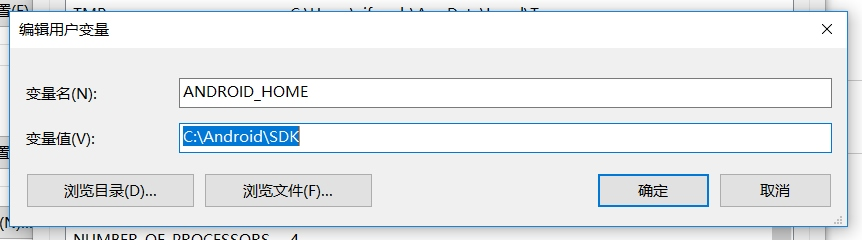
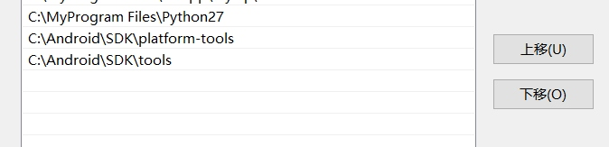
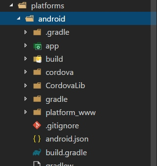

# Cordova混合开发简易指南

## 开发环境准备

### 环境搭建分4步走

- 1. 安装[Cordova](https://cordova.apache.org/)

```shell
npm i -g cordova
或
yarn add cordova -g
```

**注：**全局安装后在命令行使用`cordova`指令（当然前提是node已添加环境变量），这里有一个坑就是如果你的npm/yarn安装目录经过自定义修改的话，可能并不安装在目录存在不正确，这时候就需要手动调整了！

- 2. f7-vue构建 Webpack Cordova APP template

```shell
cordova create <your projectname> <com.example.projectname> --template cordova-template-framework7-vue-webpack
# eg: cordova create App com.ela.app --template cordova-template-framework7-vue-webpack
# 上面命令执行之后会在CLI启动的目录下生成项目的目录
```

**注：**采用[framework7-vue](http://framework7.io/vue/templates.html)的实现方案

- 3. cordova添加Android、browser平台

> browser平台用于开发，Android平台用于编译打包、真机测试等

```shell
cordova platform add android
cordova platform add browser
```

- 4.启动项目

 4.1 浏览器环境启动

```shell
cordova run browser -- --lr
# 初次跑这个命令的时候，cordova会自动识别依赖是否安装，没有安装会自动调用 npm install 指令
```

**说明：** `-- --lr`参数的作用是启动webpack HRM服务器热更新功能，这主要是用于开发环境的
***另外，开启真机开发热更新调试的时候，记得先让手机与电脑处于同一局域网！！！***

 4.2 Android studio或者真机启动

 > 首先，先在本地环境配置好ANDROID_HOME环境变量，以及添加对应的SDK目录到PATH环境变量







```shell
cordova run android
# 初次构建项目较慢
# 使用android手机连接电脑，打开USB调试
# 或者启动android模拟器(例如Android Studio的内置模拟器)
```

## APP打包发布

这里还有一个坑就是，如果你本地环境没有配置Android打包的**keystore密钥文件**的话，打包后的APK安装可能会无法安装

下面方法可以解决：

在android目录下新建一个`release-signing.properties`文件，里面设置如下：

```properties
    storeFile=C:/Users/zifengb/android_keygen.jks（keystore密钥文件保存路径）
    keyAlias=key0（keystore密钥别名，不知道就没办法了……Android Studio构建的密钥的话，可以打开找到！）
    storeType=jks（keystore密钥类型，一般用Android Studio构建密钥可以选定）
    keyPassword=123456（建密钥时候的密码）
    storePassword=123456（存储密钥时的密码）
```

解决后，执行以下指令即可进行APK编译打包

```shell
cordova build android
或
cordova build release
```

 打包完成之后，在`android/app/build/outputs`目录下，可以找到打包后目录找到APK安装包 -- `release`和`debug`版
