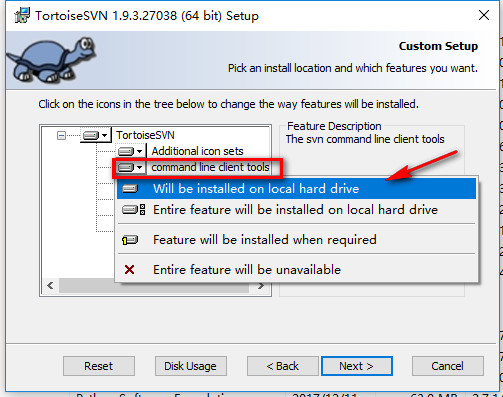

# Download Github库的某一目录

## 前言

> 使用过`Git`版本控制系统的朋友应该都知道怎么克隆Github远程仓库的源码，那如果是仓库源码的某一个目录呢？

## SVN

是的，如果你已经安装了`svn`，使用它足以解决；打开`cmd`/`powershell`输入以下命令测试

```shell
svn --version
```

**如果你安装了SVN，但是仍然发现`svn`命令不可以使用，这说明你没有安装CLI**
（以windows为例，进入控制面板修改SVN安装的配置）



完成后，重新使用`cmd/powershell`测试！

如果正常输出版本信息等内容，则可以进行下一步，假设你需要下载的目录是：
`https://github.com/mattboldt/typed.js/tree/master/lib`
按以下情况分别替换路径

* `master`主分支；将`/tree/master`替换为`/trunk`
* 其他分支，假设是`dev`；将`/tree/master`替换为`/branches/dev`

```shell
# 当前目录生成lib文件夹，且包含.svn版本控制
svn checkout https://github.com/mattboldt/typed.js/trunk/lib
# or 不包含.svn版本控制，只是简单下载
svn export https://github.com/mattboldt/typed.js/trunk/lib
```

::: tip
可以使用`svn ls`命令查看下载目录包含的文件
:::

For Instance:

```shell
svn ls https://github.com/mattboldt/typed.js/trunk/lib
```

## 浏览插件

chrome: [gitzip-for-github](https://chrome.google.com/webstore/detail/gitzip-for-github/ffabmkklhbepgcgfonabamgnfafbdlkn)

firefox: [gitzip](https://addons.mozilla.org/en-US/firefox/addon/gitzip/)

**使用方法详细参考官网说明**

## 其他方式

[gitzip](http://kinolien.github.io/gitzip/) - 需要添加**Github Access Token**

[DownGit](https://minhaskamal.github.io/DownGit) - 测试过，不知道是否外网原因，速度感人效果并不好


