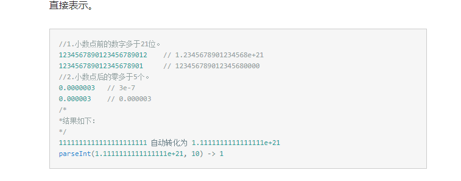

# 你不知道的parseInt

## 前言

> 原由：
> 偶然看到一个略微奇妙的代码`['1', '2', '3'].map.(parseInt)`
> 初看之时，瞬间得出答案[1, 2, 3]（虽然心底有些许疑问的声音~）
> 因此追溯根源，没想到答案让我惊呼WTF?（这里黑人问号，手动滑稽）
> 查询了MDN、Standard ECMA-262等文档，因此得出下文结论，由于英语渣渣，所以有不恰当的地方希望各位帮忙斧正~

## parseInt函数

* `parseInt`是**ECMAScript**核心的一个全局函数，可以在实现了**ECMAScript**的宿主环境全局调用

废话不多说，下面就是探讨`parseInt`函数的正文：
MDN查询得知 -> `parseInt(string, [int radix])`
是的,parseInt函数其实有两个形式参数,正是因为我记得这一点才催生了我前文提到的疑问和导致这篇科普文的诞生

## 一个形式参数

相信，很多人都使用过`parseInt`函数传递一个形式参数的时候,这很简单嘛，不就是把字符串转换成Int32类型的整数？
没毛病，老铁双击666~
```javascript
    console.log(parseInt('12'));
    console.log(parseInt('08'));
    console.log(parseInt('0x16'));
    console.log(parseInt('-12'));
    console.log(parseInt('   -12'));
    console.log(parseInt('   -  12'));
    console.log(parseInt('124ref'));
    console.log(parseInt('ref'));
```
以上几乎就是`parseInt`函数一个形式参数时的所有情况，那么结果都是啥呢？希望大家手动执行下代码:)手动滑稽

> 其中，要特殊注意的就`08`、`0x16`、`   -  12`

1. 首先呢，有人看到我说要特殊注意的第一个字符串的时候，可能心里会暗想（up主4不4傻），这么简单有需要注意的？
其实呢，我也是google了一下关于`parseInt`函数的**中文**博文（嗯，是的没错(/▽＼)）,发现了一个奇怪的事情 -> [传送门](http://blog.csdn.net/guoxu775/article/details/5914796)
这篇博文的up主说`parseInt('08')`的结果得不到**8**，我默默地打开Chrome的devTool，一跑发现没毛病啊！！！看了一下博文的时间是2010年，因此推断是**ECMAScript**标准作祟，如果不是那我也就...（摊手~）
2. `0x16`这个特殊注意点呢，也很平常其实，就是16进制前缀嘛，看过Javascript权威指南的都懂，没了解过的呢看我看我来说FreeStyle...`parseInt`传递的第一个形式参数是字符串类型的，底层实现会先识别该字符串时候是否有`0x`或者`0X`前缀，如果有呢，第二个形式参数（radix）就会被赋值为**16**，也就是十六进制，然后`parseInt`再把这个十六进制转换为十进制Number类型
3. `   -  12`,这个就更为简单点啦，就是识别有没有负号前缀，有的话会转换成负整数。但是有一点注意的是**空格**，空格出现在`parseInt`函数的string形参最前面和最后面都会被忽略，然而出现在特殊前缀（英文翻译为code unit）`0x`或`0X`和`-`就会有问题，parseInt无法进行转换返回**NaN**

## 两个形式参数

* 那么重头戏来了，这篇科普文的精髓部分，不要睡着啊~老铁

`parseInt(string, [int radix])`第二个形参是可以忽略的，忽略时默认赋值为**10**也就是十进制

> radix就是指定第一个形参的进制类型，然后根据这个进制类型**再转换为十进制整数**（敲黑板~）

radix形参没指定的时候是**10**，其次他是具有有效范围滴：[2, 36]和特殊值0
下面是英语渣渣的我翻译后，简化的`parseInt`执行步骤：（ECMAScript原解析->[传送门](http://www.ecma-international.org/ecma-262/6.0/#sec-parseint-string-radix)）
1. 将第一个形参转换为字符串
2. 识别string转换是否有**code unit**，如果有 -> `-`标记为负数，`0x`或`0X`则把radix赋值为**16**
3. radix形参（int类型）是否存在，存在则重新赋值（会对实参进行Int32转化，无法转换成int类型则不会重新赋值radix）
4. radix为0，则设置radix为默认值10
5. 如果radix为1，或者大于等于37，parseInt直接返回**NaN**
6. 如果radix为[2, 36]时则代表，string参数分别是二进制，三进制（如果有得话~）...三十六进制类型
7. 然后对string进行的radix进制 -> 十进制转换

以上就是`parseInt`转换时的步骤，那么我们来开始解释`['1', '2', '3'].map.(parseInt)`
**at first, 答案是`[1, NaN, NaN]`**
```javascript
    (function (){
		var ret = ['1', '2', '3'].map((value, index)=>{
			console.log(value, index);
			return parseInt(value, index);
		});
		console.log(ret);
    })();
```
这是`['1', '2', '3'].map.(parseInt)`内部执行的剖析，`value`和`index`相信大家都懂，不懂请自行[MDN](https://developer.mozilla.org/en-US/docs/Web/JavaScript/Reference/Global_Objects/TypedArray/map),执行步骤为：
`value='1',index=0` -> `parseInt(value, index)`
`value='2',index=1` -> `parseInt(value, index)`
`value='3',index=2` -> `parseInt(value, index)`
抽离出来，其实就是
```javascript
    parseInt('1', 0);
    parseInt('2', 1);
    parseInt('3', 2);
```
按照我前面分析的`parseInt`转换步骤，可以很轻易的得出前面两个的答案，那么第三个呢？手动滑稽、黑人问号...哈哈
其实，也很简单啦，`parseInt('3', 2)`这是根据二进制对字符串`3`进行十进制转换对吧！！！
exm???有毛病?没毛病，老铁，就是......你家二进制有`3`?二进制不就是`0`和`1`啊
就是`0`和`1`啊
是`0`和`1`啊
`0`和`1`啊
和`1`啊
`1`啊
啊
因此返回**NaN**，666

## 佐证如下：

`parseInt('13', 2)`，这个结果是......`1`，因为string参数如果最开始的code符合radix进制的话是可以进行解析转换的，正如这里'1'是符合二进制的，'3'是不符合二进制的，但`1`处于优先位置，所以可以进行转换解析，而`3`被无情地忽略~

## Lastly,我们来动手一下吧:)
```javascript
    parseInt('9', 8);
    parseInt('0x16', 10);
    parseInt('-10', 16);
    parseInt('5/8/2017', 'javascript is such funny');
```

## 后记

> 这只是一篇科普文，大家relaxed一下，毕竟世界竟如此好玩~最后不喜勿喷，欢迎大家指出**不足和错误**的地方，感谢阅读

## 补充

1. `parseInt(string, radix)`，当`string`不是以数字和特殊前缀开头，以字母开头时，`parseInt`根据`radix`来限制转换
```javascript
    // 奇怪的栗子
    parseInt(null, 24); // 23
```
2. 奇怪的操作



```javascript
    parseInt(0.0000008) === 8
    // 原理是：String(0.0000008) -> '8e-7'，临界值是小数点后有6位0
    parseInt(1000000000000000000000.5) === 1
    // 原理是：String(1000000000000000000000.5) -> '1e+21'，临界值是小数点前有21位0
```

> 解释：这是因为radix为24时，`n`可以被识别，因为这是字母表的第14位!!!其实这里原理和十六进制一毛一样，十六进制使用`A-F`代表`10-15`

## 参考文献

1. [MDN](https://developer.mozilla.org/en-US/docs/Web/JavaScript/Reference/Global_Objects/Number/parseInt)
2. [Standard ECMA-262](http://www.ecma-international.org/ecma-262/6.0/#sec-parseint-string-radix)
3. [图解进制转换](http://www.cnblogs.com/gaizai/p/4233780.html)
