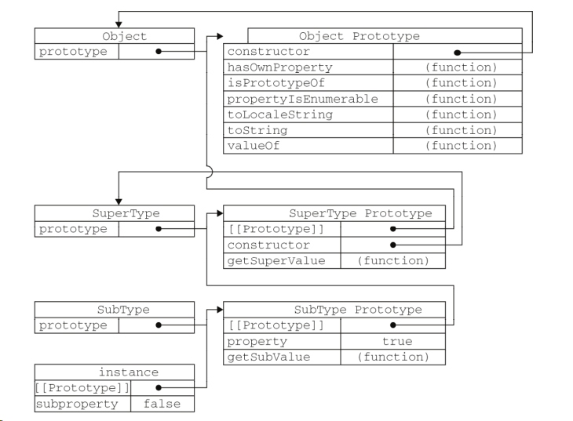

# JavaScript之原型解析（上）

<!-- 发布日期：{{ $page.frontmatter.date }} -->

## 前言

> 原型这个概念在JavaScript这门语言中是一个核心关键的知识点，但是你是否真的已经完全理解透彻了呢?可能我个人的理解能力较差，因此经过多次翻阅书籍和实践我才真正了解原型，所以记录下来以加深理解，也以便日后深入探讨。如有不正确的地方，欢迎斧正！

## 原型涉及到的概念

> 1. `__proto__`/`[[prototype]]`
> 2. `prototype`
> 3. `constructor`

### 区分原型指针和原型属性
**注：**首先要区分的是原型指针`__proto__`/`[[prototype]]`和原型属性`prototype`，很多时候我们可能会把它们混为一谈，但是两者实际上不是同一种东西！！！

* 原型指针`__proto__`/`[[prototype]]`

先来看一个例子：
```js
var obj = {};
function fn() {};
console.log(obj.__proto__ === Object.prototype); // true
console.log(obj.__proto__ === Object.getPrototypeOf(obj)); // true
console.log(fn.__proto__ === Function.prototype); // true
console.log(fn.__proto__ === Object.getPrototypeOf(Function)); // true
```
实际上，**实例对象**的原型指针`[[prototype]]`在某些宿主环境下是不能读取到的；
但也有例外:
(1) 在浏览器环境下原型指针可以使用`__proto__`属性读取到
(2) ECMAScript 5版本增加的新方法`Object.getPrototypeOf()`可以进行读取到

**解释：**
每个对象在创建的时候都会有个原型指针的属性指向负责**构造该对象的原型对象**，以上面为例 ->
`obj`是由原型对象`Object.prototype`构造的，等同于使用new Object构造
`fn`是由原型对象`Function.prototype`构造的，等同于使用new Function构造

**经典的原型链图示**

**谨记，往原型链向上追溯，最终都是由原型对象`Object.prototype`进行构造！**


* 原型属性`prototype`

再来个栗子：
```js
var obj = {};
function fn() {};
console.log(obj.prototype); // undefined
console.log(fn.prototype === Object.prototype); // false
console.log(fn.prototype === new fn().__proto__); // true
console.log(fn.prototype === Object.getPrototypeOf(new fn)); // true
```

**解释：**
以前我一直混淆的概念就在这里，
为什么`obj.prototype`是undefined呢?
为什么`fn.prototype`指向的不是`Object.prototype`?
如果你跟我一样有这样的疑惑的话，说明你理解错了原型指针`__proto__`/`[[prototype]]`和原型属性`prototype`的概念！！！
```js
/**
* 1. 如果你想得到构造某对象的原型对象，你应该读取该对象的原型指针
* 2. 然而，读取某对象的原型属性prototype时，你的意图应该是想以该对象作为原型对象进行构造实际对象
/
// 这就解析了为什么，实例对象new fn的原型指针__proto__指向了fn.prototype(fn的原型属性)
// 另外，因为obj是普通对象，不可以使用new关键字进行构造实例，因此自然也就没有原型属性了 -> undefined
```
**如果还有疑惑，建议结合上面经典的原型链图示进行思考！**

* 构造器指针`constructor`

老规矩，上代码
```js
var obj = {};
function fn() {};
console.log(obj.constructor === Object); // true
console.log(fn.constructor === Function); // true
console.log(obj.hasOwnProperty('construnctor')); // false
console.log(fn.hasOwnProperty('construnctor')); // false
```
通过以上代码，我们可以知道，其实`obj`和`fn`对象自身并没有`constructor`这个属性，实际上`constructor`是**构造他们的原型对象上面的属性**，并且指向构造对象本身！（once again，如果还有疑惑请建议结合上面经典的原型链图示进行思考！）

## 参考文献

> 1. javascript高级程序设计（第三版）——[美]Nichilas C.Zakas 著
> 2. javascript权威指南（第6版）——David Flangan 著 淘宝前端团队 译
